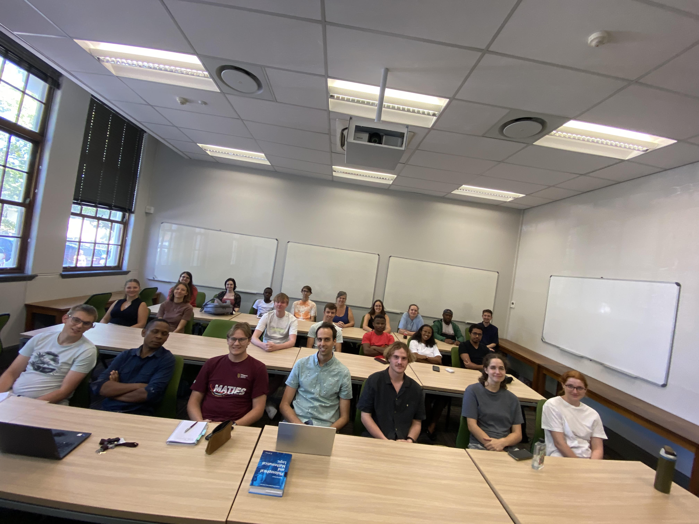

# The Riemann Academy

The Riemann Academy is a forum to nurture undergraduate and postgraduate mathematical talent at Stellenbosch. It is a combined initiative of the [Number Theory and Geometry research group](https://math.sun.ac.za/research/groups/number-theory-geometry/) and the [Functional Analysis](https://math.sun.ac.za/research/groups/functional-analysis/) research group. We have a talk (roughly) every week, currently on Thursdays in 1006 at 1:10pm.

To sign up to the mailing list, email Prof Bartlett at bbartlett@sun.ac.za.

## Talks

* **Bruce Bartlett**, *The qunitic, the icosahedron and elliptic curves*. Thursday 22 February 2024, 1pm in venue 1006.  [Notes](bruce_22Feb2024.pdf)

    I will explain the magical connection between solving the roots of quintic polynomial equations, the icosahedron, and elliptic curves! See [article](https://math.sun.ac.za/bbartlett/assets/quintic/The quintic, the icosahedron and elliptic curves.pdf) here (to be published in the Notices of the AMS) and the accompanying [Mathematica notebook](https://math.sun.ac.za/bbartlett/assets/quintic/The quintic, the icosahedron and elliptic curves.nb).
